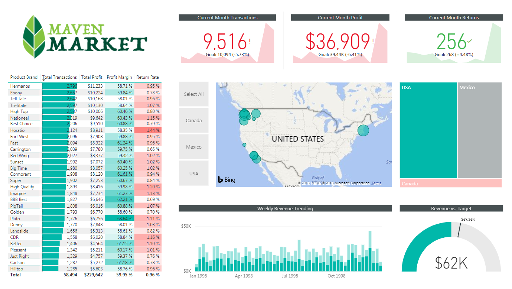

# 🛒 Maven Market - Business Intelligence Dashboard

This project is an end-to-end Business Intelligence solution built using Power BI to analyze sales performance, customer behavior, and business KPIs for a retail company (Maven Market).

## 📊 Project Overview
The dashboard provides interactive and dynamic insights into key business metrics such as transactions, profit, returns, and revenue trends. It enables stakeholders to make data-driven decisions by monitoring performance across different regions, products, and time periods.

## 🎯 Key Features
- 📈 **KPI Tracking**: Monitor total transactions, profit, and returns against targets
- 🌍 **Geographical Analysis**: Visualize sales distribution across regions using map visuals
- 🛍️ **Product Performance**: Analyze top-performing brands based on profit and transactions
- 📉 **Return Rate Analysis**: Identify products with high return rates
- 📊 **Revenue Trends**: Track weekly revenue patterns and seasonality
- 🎯 **Target vs Actual**: Compare business performance against predefined goals

## 🧠 Business Insights
- Identified high-performing product categories and regions
- Detected patterns in customer returns and profit margins
- Enabled better decision-making through clear KPI visualization

## 🛠️ Tools & Technologies
- Power BI (Data Visualization & Dashboarding)
- SQL (Data Preparation & Analysis)
- Data Modeling (Star Schema)
- DAX (Measures & Calculations)

## 📂 Dataset
The dataset includes:
- Transactions (1997–1998)
- Customers
- Products
- Stores
- Regions
- Returns

## 📌 Key Skills Demonstrated
- Data Analysis
- Data Visualization
- Business Intelligence
- Data Modeling
- KPI Design
- Storytelling with Data

## 📸 Dashboard Preview

---

## 🚀 How to Use
1. Download the `.pbix` file  
2. Open it using Power BI Desktop  
3. Explore the interactive dashboard  

---

## 👨‍💻 Author
Hazem Mohamed  
